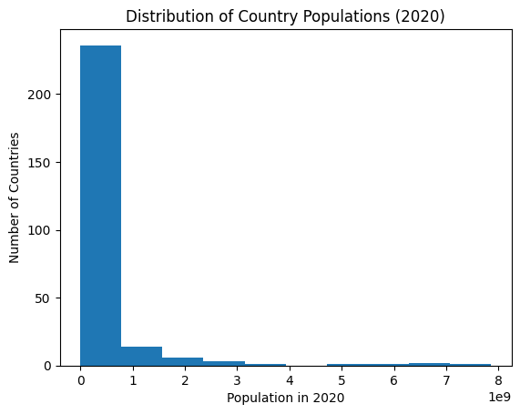

# Task-01: Population Distribution Visualization

## 📌 Objective
The objective of this task is to create a visual representation of the distribution of a variable using either a **bar chart** or a **histogram**.  
In this task, a **histogram** is used to visualize the distribution of population across countries.

---

## 📊 Dataset Description
- **Source:** World Bank Open Data  
- **Indicator:** Total Population  
- **Dataset File:** `API_SP.POP.TOTL_DS2_en_csv_v2_38144.csv`  

The dataset contains population data for multiple countries from **1960 to recent years**.

---

## 🛠️ Tools & Libraries Used
- Python
- Pandas
- Matplotlib

---

## ⚙️ Steps Followed

1. Imported required Python libraries (`pandas`, `matplotlib`).
2. Loaded the World Bank dataset while skipping metadata rows.
3. Selected population data for the year **2020**.
4. Removed missing values to ensure clean data.
5. Created a histogram to visualize population distribution.
6. Added appropriate labels and title for clarity.

---

## 📈 Visualization
- **Chart Type:** Histogram  
- **Variable Type:** Continuous (Population)
- **Bins:** 30

The histogram represents how population values are distributed across different countries.

---

## 🔍 Interpretation
The visualization shows a **right-skewed distribution**, indicating that:
- Most countries have relatively smaller populations.
- A small number of countries have extremely large populations.
- Population is unevenly distributed across the world.

---

## ✅ Conclusion
This task demonstrates how histograms can be effectively used to analyze and visualize the distribution of continuous data. Such visualizations help in understanding data spread, skewness, and overall patterns within large datasets.

## ✨ Author
**Om Dhaigude** 

---

